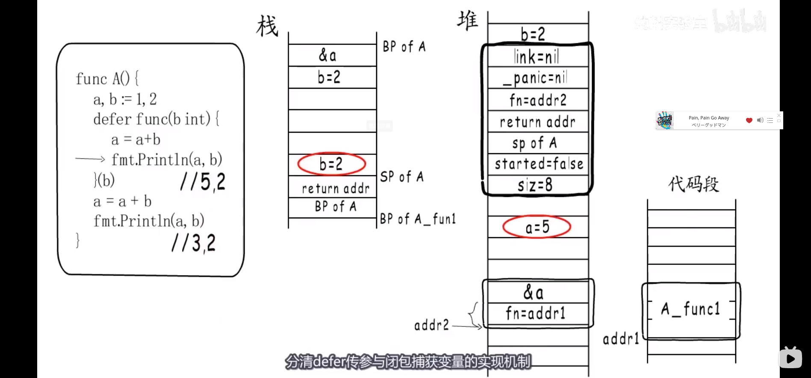
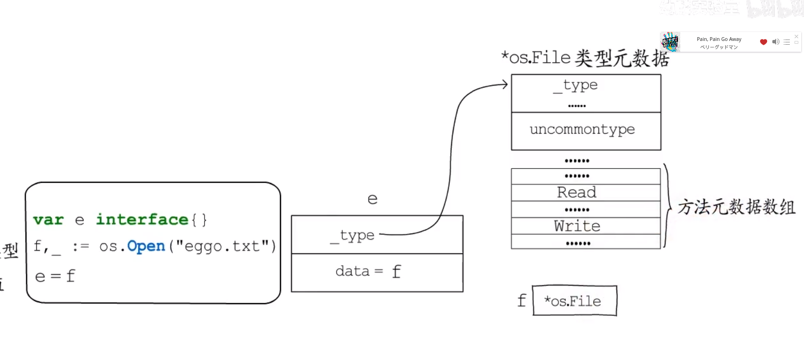
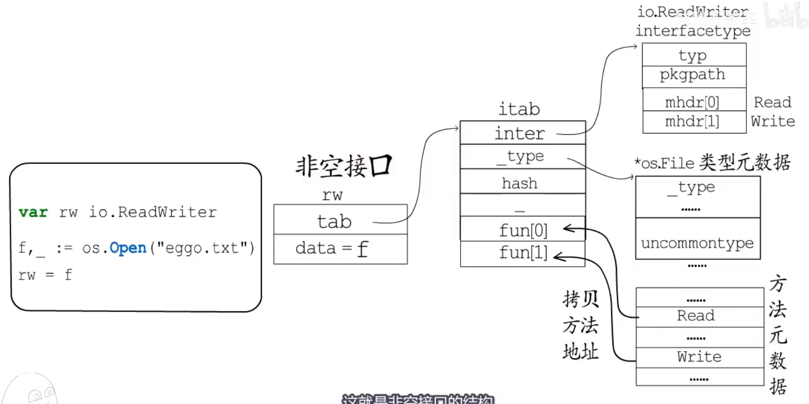
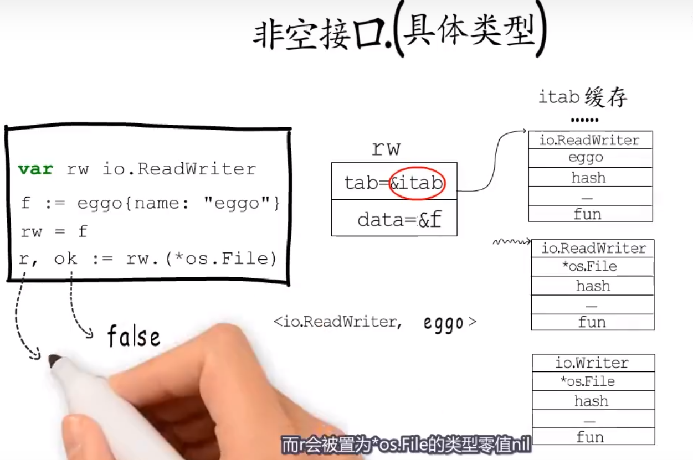
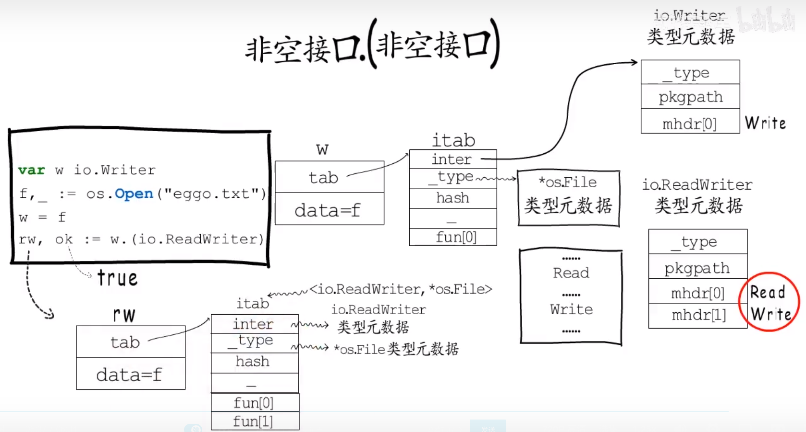

# string

### 从编码说起
- 一个字节由8个比特组成，当比特位全为0时代表数字0，全为1时代表数字255，一个字节可以表示256个数字，2个字节可以表示65536个数字。
- 而字符的表示方法与之不同，是通过将字符进行编号，比如将`A`编号为`65`，对应二进制的`01000001`是这个字符的编码，通过这种映射关系可以将字符以比特的形式存起来，而这种映射关系就是字符
集。
- 常见的字符集有： ASCII GB18030 GBK Unicode等等
**字符集促成了字符与二进制的合作，但如何表示字符串呢？**

`hello世界`

|字符|编号|二进制|
|--|--|--|
|h|104|0110 1000|
|e|101|0110 0101|
|l|108|0110 1100|
|l|108|0110 1100|
|o|111|0110 0111|
|世|19990|01001110 00010110|
|界|30028|01110101 01001100|

如果不加处理直接存放就是`01101000|01100101|01101100|01101100|01100111|0100111000010110|0111010101001100`，可以发现如果将分隔符去掉我们完全不知道这些比特串将要表达什么意思。
#### 解决方案
- 定长编码
无论字符的二进制表示原本有多长，全部按字符集最长的编码来比如 `e`:`00000000 00000000 00000000 01100101`
但这样明显是在浪费内存
- 变长编码
小编号字符少占用字节，大编号字符多占用字节

|编号|编码模板|
|---------|----------|
|`[0,127]`|`0???????`|
|`[128,2047]`|`110????? 10??????`|
|`[2048,65536]`|`1110???? 10?????? 10??????`|

比如对于`世` 编号`19990` 二进制表示`01001110 00010110` 变长编码 1110 `0100` 10`111000` 10`010110`

**以上编码方式就是所谓的`UTF-8`编码，也就是GO语言默认的编码方式**

### string in golang
`var str string = "hello"`
在c中字符串变量存放着一块以`\0`结尾的连续内存的起始地址，在go中字符串变量不光存放这个地址，还存放着这块连续内存用多少个字节(源码包 `src/runtime/string/string.go:stringStruct`)
~~~ go
type stringStruct struct {
	str unsafe.Pointer
	len int // go的int 8Byte
}
~~~

string的数据结构跟切片有些类似，只不过切片还有一个表示容量的成员，事实上string和切片准确来说是`[]byte`经常发生交换

~~~ go
var str string
str = "Hello 世界"
~~~
字符串生成时，会先构建stringStruct对象，在转换成string，源码：
~~~ go
func gostringnocopy(str *byte) string {
	ss := stringStruct{
		str: unsafe.Pointer(str),
		len: findnull(str),
		}
	s := *(*string)(unsafe.Pointer(&ss))
	return s
}
~~~
#### 字符串拼接
字符串可以方便地拼接`str := "Str1" + "Str2`
即便有非常多的字符串需要拼接，性能上也有比较好的保证，因为新字符串的内存空间是**一次分配**完成的，所以性能消耗主要在拷贝数据上
在`runtime`包中，使用concatstrings()函数来拼接字符串。在一个拼接语句中，所有待拼接的字符串都被编译器组织到一个切片中传入concatstrings函数，拼接的过程需要遍历两次切片 ，第一次获取长度来申请内存，第二次将字符逐个拷贝过去（以下是伪代码）
~~~ go
func concatstrings(a []string) string{
	length := 0
	for _,str := range a {
		length += len(str)
	}
	//分配内存 返回一个string 和 slice 它们共享内存
	s,b := rawstring(length)
	//string无法修改 可以通过切片修改
	for _,str := range a{
		copy(b,str)
		b = b[len(str):]
	}
	return s
}
~~~
rawstring() 的源码，初始化一个指定大小string同时返回一个切片二者共享同一块内存空间，后面向切片中拷贝数据，就间接地修改了string
~~~ go
func rawstring(size int) (s string, b []byte) {
	p := mallocgc(uintptr(size), nil, false)

	stringStructOf(&s).str = p
	stringStructOf(&s).len = size

	*(*slice)(unsafe.Pointer(&b)) = slice{p, size, size}

	return
}
~~~

#### 类型转换
##### []byte 转 string
~~~ go
func slicebytetostring(buf *tmpBuf, b []byte) (str string) {
	
	//非主要代码
	
	var p unsafe.Pointer
	if buf != nil && len(b) <= len(buf) {
		//预留空间够就用预留空间
		p = unsafe.Pointer(buf)
	} else {
		//预留空间不够就申请新内存
		p = mallocgc(uintptr(len(b)), nil, false)
	}
	//构建字符串
	stringStructOf(&str).str = p
	stringStructOf(&str).len = len(b)
	//将切片底层数组拷贝到字符串
	memmove(p, (*(*slice)(unsafe.Pointer(&b))).array, uintptr(len(b)))
	return
}

~~~
##### string 转 []byte

~~~ go
func stringtoslicebyte(buf *tmpBuf, s string) []byte {
	var b []byte
	if buf != nil && len(s) <= len(buf) {
		*buf = tmpBuf{}
		b = buf[:len(s)]
	} else {
		//申请未经初始化的切片（string的内容会完全覆盖切片）
		b = rawbyteslice(len(s))
	}
	copy(b, s)
	return b
}
~~~
# 总结
<font color=#999AAA >
golang的string不包含内存空间，只有一个内存的指针，这样的好处是String变得非常轻量，可以方便地进行传递而不用担心内存拷贝

# slice

## slice的特性
又称动态数组，依托数组实现，可以方便地进行扩容和传递，实际使用时比数组更灵活。
~~~ go
type slice struct {
	array unsafe.Pointer
	len   int
	cap   int
}
~~~
以上是go中slice的声明。
### 初始化
- `var ints []int`
- `ints := make([]int , 2 ,5)`  // make 会分配底层数组
- `ps := new([]string)`  //注意这里的ps是一个指针 new不会分配底层数组
- `array := [5]int{1,2,3,4,5} 	s1 := array[0:3]  s2 := s1[0:1]`
### 切片操作与切片表达式
##### 简单表达式
`a[low : hihg]`
如果 a 为数组或者切片，则该表达式将切取 `a[ low , high ) `的元素，如果 a  为string 该表达式将会生成一个string,而不是slice
~~~ go
a := [5]int{1,2,3,4,5}
b := a[1:4]
b[0] = 2
c := b[1:2]

~~~
根据之前切片结构的声明，我们知道 slice 有三个元素，对于array(底层数组地址)，着重强调，使用简单表达式生成的slice将与原数组或slice共享底层数组，新切片的生成逻辑可以理解为
~~~ go
b.array = &a[low]
b.len = heigh - low
b.cap = len(a) - low //注意 b 的 cap 不是 len(b)
~~~
大家可以试试以下代码的输出
~~~ go
func SlicePrint() {
        s1 := []int{1, 2}
        s2 := s1
        s3 := s2[:]
        fmt.Printf("%p %p %p\n", &s1[0], &s2[0], &s3[0])
}

func SliceCap() {
        var array [10]int{1,2,3,4,5,6,7,8,9}
        var slice = array[5:6]
		var slice2 = array[9:10]
		
        fmt.Printf("len(slice) = %d\n", len(slice))
        fmt.Printf("cap(slice) = %d\n", cap(slice))
        
        fmt.Printf("len(slice) = %d\n", len(slice2))
        fmt.Printf("cap(slice) = %d\n", cap(slice2))  
}
~~~
在上面的例子中如果给slice2添加新元素 `slice2 = append(slice2,10)`，原本的底层数组就不够用了，这时go会分配一段的内存空间作为底层数组，并将slice中的元素拷贝到新的数组中然后将新添加的元素加到数组中，而这段新的内存有多大呢，这在一会儿的实现原理中说。

另外，需要注意，如果简单表达式的对象是slice，**那么表达式a[low : high]中 low 和 high 的最大值可以是 a 的容量，而不是 a 的长度**。

##### 扩展表达式
`a[low : high : max]`
简单表达是生成的新slice与原数组共享底层数组避免了拷贝元素，节约内存空间的同时可能会带来一定的风险。
新slice （`b := a[low:high]`）不仅仅可以读写 a[low] 到 a[high-1] 的元素，而且在使用`append(a,x)`添加新的元素还会覆盖掉 a[high]以及后面的元素
~~~ go
a  := [5]slice{1,2,3,4,5}
b := a[1:4]
b = append(b,0)
fmt.Println(a[4]) //0
~~~
而扩展表达式就是解决这个问题的机制 ，low high max 满足 `0 <= low <= high <= max <= cap(a)` `max`用于限制新生成切片的容量，新切片的容量为 `max - low`

~~~ go
array := [10]int
a := array[5:7] //cap = 5
b := array[5:7:7] //cap = 2
~~~

## slice的实现原理
slice的使用很灵活，但是想要正确使用它，就要了解它的实现原理。
- `var ints []int`   slice{array : nil , len : 0 , cap : 0}
- `ints := make([]int , 2 ,5)` slice {array : 一段连续内存的起始地址(同时将元素全部初始化为整型的默认值 0 ) , len : 2 , cap : 5}  

	- slice元素的访问
		~~~ go
		ints := make([]int,2,5)
		fmt.Pritln(ints[0])
		ints = append(ints , 3)
		// ints 的底层数组变化为 0 0 3 0 0 但只可以访问前三个元素 之后的属于越界访问
		~~~
- `ps := new([]string)` slice{array : nil , len : 0 , cap : 0}
	- 这里`ps` 就是slice结构体的**起始地址**，这时slice还没有分配底层数组，如果想要向slice中添加元素需要使用内置函数`append()`  `*ps = append(*ps , "hello世界")` 这样 *ps.array 指向的就是一个 `stringStruct` stringStruct{ str : 底层数组起始地址, len : 11}

slice 依托数组实现，底层数组对用户屏蔽在底层数组容量不足时可以实现自动分配并生成新的slice
#### 扩容
扩容容量的选择遵守以下规则
- 如果原slice的容量翻倍后仍然小于最低容量需求 cap ，就直接扩容到 cap
- 否则，如果原slice的容量小于1024，则新slice的容量将扩大为原来的2倍
- 如果原slice的容量大于等于1024，则新slice的容量将扩大为原来的1.25倍
`src/runtime/slice.go:growslice`
~~~ go
	newcap := old.cap
	doublecap := newcap + newcap
	if cap > doublecap {
		newcap = cap
	} else {
		if old.len < 1024 {
			newcap = doublecap
		} else {
			// Check 0 < newcap to detect overflow
			// and prevent an infinite loop.
			for 0 < newcap && newcap < cap {
				newcap += newcap / 4
			}
			// Set newcap to the requested cap when
			// the newcap calculation overflowed.
			if newcap <= 0 {
				newcap = cap
			}
		}
	}

~~~

在此规则之上，还会考虑元素类型与内存分配规则，对实际扩张值做一些微调。比如，os常常将内存切分为 64、80、96、112 等常用的大小 go的内存分配机制会根据预估大小匹配合适的内存块分配给新slice。


# Map

## hash与buckets
说到键值对的存储，我们就会想到哈希表，哈希表通常会有一堆桶来存储键值对，一个键值对来了自然要存到一个桶中。首先将key通过hash()处理一下得到一个hash值，现在要利用这个hash值从m个桶中选择一个，桶的编号区间 [0,m-1] 。

### 取模法 
`hash%m`
### 与运算法 
`hash & (m-1)`

**想要使用与运算法就要限制桶的个数 m 必须是2 的整数次幂，这样 m 的二进制表示一定只有一位为1，(m-1) 就是除了最高为其他均为 1 ，避免一些桶绝对不会被选中的情况**

如果之后有其他键值对也选择了同一个桶，就是发生了**哈希冲突**，解决方案一般是 **开放地址法** 和 **拉链法**
- 开放地址法 就是在发生冲突的桶后找没有被占用的桶来存放键值对，查找时定位到桶后hash不匹配，就继续向下找直到遇到空桶。
- 如图

### 解决hash冲突
- 发生hash冲突会影响hash表的读写效率，选择散列均匀的 hash() 可以减少hash冲突的发生
- 适时对hash表进行扩容意识保障读写效率的有效手段，通常会把`（count of key : value） / m`作为是否需要扩容的判断依据，这个比值被称作`负载因子`

当需要扩容时，就要分配更多的桶，将旧桶中的数据迁移时，为了避免一次性迁移大量数据带来的性能损耗，通常会在hash表扩容时先分配足够多的新桶，然后用一个字段记录旧桶的位置，再加一个字段记录旧桶迁移的进度(记录下一个要迁移的旧桶编号)，在每次hash表读写操作时，如果检测到当前正处于扩容阶段就完成一部分键值对迁移任务，直到所有的键值对迁移完成，旧桶不再使用，算完成了一次扩容操作，这就是所谓`渐进式扩容`

## map in golang
`src/runtime/map.go:hmap`
~~~ go
type hmap struct {
	count     int // 已经存储的键值对数目
	flags     uint8
	B         uint8  // 桶的数目是 2^B golang使用了与运算法
	noverflow uint16 // 溢出桶数量
	hash0     uint32 // hash seed

	buckets    unsafe.Pointer // 桶在哪儿
	oldbuckets unsafe.Pointer // 扩容阶段的旧桶位置记录
	nevacuate  uintptr        // 扩容时，下一个要迁移的旧桶编号

	extra *mapextra // optional fields
}
~~~
再来看看map用的桶长什么样。也就是 bmap 
- 一个桶中可以存放8个键值对，但是为了让内存排列更加紧凑，采用 8个键+8个值 的存放方式，在键值对之上是8个 `tophash` 每个tophash都是对应hash值的高8位，最后的 `voerflow`bmap指针指向`溢出桶`，`溢出桶`的结构与常规桶相同，是为了减少扩容次数而引入的。当一个桶存满了，还有可用的溢出桶是时，就会在同种桶后链接一个溢出桶，实际上，如果哈希表要分配的桶的数目大于`2^4`时就认为使用到溢出桶的几率较大，就会预分配 `2^(B-4)`个溢出桶备用，这些溢出桶和常规桶在内存中是连续的 ，前 `2^B`用作常规桶，后面的用于溢出桶


~~~ go
type mapextra struct {

	overflow    *[]*bmap   // 目前已经被使用的溢出桶的地址
	oldoverflow *[]*bmap // 扩容阶段存储存储旧桶用到的那些溢出桶的地址

	nextOverflow *bmap  //下一个空闲溢出桶
}
~~~


如果将这个桶存满的话，接下来再继续存储新的键值对时，这个hash表是会创建溢出桶还是会发生扩容呢?
### map的扩容规则
Go语言的map默认负载因子(count / (2^B))是 6.5 （即平均每个buckets存储的键值对达到6.5个以上）,超过这个值就会发生翻倍扩容，分配新桶的数目是旧桶的两倍 
- `hamp`中的`buckets`指向新分配的两个桶
- `oldbuckets`指向旧桶，`bevacuate`为0表示接下来要迁移编号为0的旧桶
- 过程如图所示

还有一种情况也会触发扩容，就是负载因子没有超标，但是溢出桶使用较多。
- `B` <= 15 `noveflow` > 2^B
- `B` > 15   `neverflow` >= 2^15

这种情况针对的是在某些极端情况下，例如经过大量的元素增删后，兼职对刚好集中在一小部分buckets中，这时会发生**等量扩容**，即buckets不变，重新做一次类似增量扩容的迁移动作，将松散的键值对重新排列一次。


# 函数调用栈

# 闭包

``` go
func A() {

}

func B(f func()) {

}

func C() func() {
    return A
}

var f func() = C()
```

上面的函数 函数参数 函数返回值 变量都是`function value`

`function value` 本质上是一个指向代码段函数指令入口的`指针` `runtime.funcval`

``` go
type funcval {
    fn uinptr
}
```

``` go
func A(i int) {
    i++
    fmt.Println(i)
}

func B() {
    f1 := A
    f1(1)
}

func C() {
    f2 := A
    f2(1)
}
```

可以直接使用函数入口地址，却要使用二级指针传递，为的是处理`闭包`

``` go
func create() func() int {
        c := 2 // 捕获变量
        return func() int {
                c++
                return c
        }
}

func create2() (fs [2]func()) {
        for i := 0; i < 2; i++ {
                fs[i] = func() {
                        fmt.Println(i)
                }
        }
        return
}

func main() {
        f1 := create()
        f2 := create()
        fmt.Println(f1())
        fmt.Println(f1())
        fmt.Println(f1())
        fmt.Println(f2())
        f3 := create2()
        f3[0]()
        f3[1]()
}

```

闭包对象的指令自然在编译阶段生成，但因为每个闭包对象都要保存自己的捕获变量，所以要到执行阶段才会创建对应的闭包对象
通过f1和f2调用闭包函数，就会找到各自对应的funcval结构体，拿到同一个函数入口，但是通过不同的函数变量调用时会使用对应的捕获列表, 这就是称闭包为有状态的函数的原因了
go通过一个`function value`调用函数时，会把对应的`funcval`结构体地址存入`DX`寄存器, 然后加上相应的偏移来找到每一个被捕获的变量，所以go中`闭包`就是有捕获列表的`function value`

被闭包捕获的变量，要在外层函数和闭包函数中表现一致，好像他们在使用同一个变量

#### 值拷贝
被捕获的变量除了初始化赋值外，没有被修改过，则直接拷贝

#### 返回值
调用这栈帧上依然会分配返回值空间，不过闭包的外层函数会在堆上也分配一个，外层函数和闭包函数都使用堆上这一个，但是到外层函数返回前吗，需要吧堆上的返回值拷贝到栈上的返回值空间

#### 参数堆分配
参数依然通过调用者栈帧传入，但是编译器会把栈上的这个参数拷贝到堆上一份，然后外层函数和闭包函数都使用堆上分配的这一个

#### 变量逃逸
局部变量i 改为堆分配，在栈上只存一个地址，这样闭包函数就和外层函数操作同一个变量了

# 方法

``` go
type A struct {
	name string
}

func (a A) Name() string {
	a.name = "Hi! " + a.name
	return a.name
}

func main() {
	a := A{name: "eintr"}
	fmt.Println(a.Name()) // 是语法糖 == A.Name(a)
	fmt.Println(A.Name(a))
}
```

这里的`a`就是所谓的方法接收者

``` go
func main() {
	t1 := reflect.TypeOf(A.Name)
	t2 := reflect.TypeOf(NameOfA)
	fmt.Println(t1 == t2)
}

type A struct {
	name string
}

func (a A) Name() string {
	a.name = "Hi! " + a.name
	return a.name
}

func NameOfA(a A) string {
	a.name = "Hi " + a.name
	return a.name
}

```

这里的pa 是指针接收者
``` go
type A struct {
	name string
}

func (a A) GetName() string {
	return a.name
}

func (pa *A) SetName() string {
	pa.name = "Hi " + pa.name
	return pa.name
}

func main() {
	a := A{name: "eintr"}
	pa := &a

	fmt.Println(pa.GetName()) // == (*pa).GetName()
	fmt.Println(a.SetName())  // == (&a).SetName()
}

```


``` go
type A struct {
	name string
}

func GetName(a A) string {
	return a.name
}

func main() {
	a := A{name: "eintr"}

	f1 := GetName
	f1(a)
}

```


``` go

type A struct {
	name string
}

func (a A) GetName() string {
	return a.name
}

func Getname(a A) string {
	return a.name
}

func main() {
	a := A{name: "eintr"}

	// func GetName(a A) string{} == func (a A) GetName() string {}
	f1 := A.GetName // 方法表达式 相当于方法原型
	f2 := a.GetName // 方法变量
	f1(a)
	f2()
	t1 := reflect.TypeOf(f1) // func(Main.A) string
	t2 := reflect.TypeOf(f2) // func() string
	fmt.Println(t1 == t2, t1, t2)
}

```


``` go
type A struct {
	name string
}

func (a A) GetName() string {
	return a.name
}

func GetFunc1() func() string {
	a := A{name: "eintr in GetFunc"}
	return a.GetName // 返回一个方法变量
}

// 以上函数等价于
func GetFunc2() func() string {
	a := A{name: "eintr in GetFunc"}

	return func() string { // 这里我们可以清晰地看到闭包是如何形成的
		return A.GetName(a) // 执行时 捕获了局部变量a 所以输出 eintr in GetFunc
	}
}

func Getname(a A) string {
	return a.name
}

func main() {
	a := A{name: "eintr in Main"}

	f2 := a.GetName // A.GetName(a)
	fmt.Println(f2())

	f3 := GetFunc1()
	fmt.Println(f3())

	f4 := GetFunc2()
	fmt.Println(f4())

}

```

# defer
关于defer 我们知道它会在函数返回之前 逆序执行

``` go
func main() {
	defer func() {
		fmt.Println(1)
	}()

	defer func() {
		fmt.Println(2)
	}()

	defer func() {
		fmt.Println(3)
	}()

}

```

编译后 会变成下面的代码(伪代码)

``` go
func A_defer() {
	r = deferproc(8, B) // 注册
	if r > 0 {
		goto ret
	}

	runtime.deferreturn() // 执行
	return

ret:
	runtime.deferreturn()
}

```

defer信息会注册到一个链表，而当前执行的goroutine持有这个链表的头指针，每个goroutine在运行时都有一个对应的结构体`g`

``` go
type runtime.g struct {
	_defer *_defer* // 指向defer链表的头部
	// _defer -> _new_defer-_defer-_defer-_defer 注意执行时是从头开始 所以先注册的后调用
}
```

``` go
func main() {
	A()
}

func A() {
	a, b := 1, 2
	defer A1(a) // defer函数的参数注册时拷贝到堆上 执行时又拷贝到栈上

	a = a + b
	fmt.Println(a, b)
}

func A1(a int) {
	fmt.Println(a)
}

```


``` go
func deferproc(size int32, fn *fancval) // A1 的参数加返回值共占多大空间 第二个fancval因为没有捕获列表 优化到只读代码段 分配一个共用的funcval结构体 所以这里是A1的地址
```

``` go

type _defer struct {
	siz     int32    // defer函数参数和返回值共占多少字节 这段空间会直接分配在_defer结构体后面 用于在注册时保存参数 并在执行时拷贝到调用者参数与返回值空间
	started bool     // defer函数是否已经执行
	sp      uintptr  // 注册这个defer的函数栈指针 通过他函数可以判断注册的defer是否已经执行完了
	pc      uintptr  // deferproc的返回地址
	fn      *funcval // 注册的函数
	_panic  *_panic
	link    *_defer // 前一个注册的defer结构体
}

```

deferproc函数调用时，编译器会在它自己的两个参数后面，开辟一段空间，用来存放defer函数的返回值和参数，这一段空间会被直接拷贝到`_defer` 结构体的后面

一个`_defer` 的内存结构
``` go
// 以下内容是堆上分配的内存
siz = 8
started = false
sp of A
return addr
fn = addr2
_panic = nil
link = nil
a = 1 // 8 byte
```

注册结束后，这个_defer结构体会被放到defer链表的头部

实际上Golang会预先分配不同规格的defer池，执行时从空闲_defer中取一个出来用，没有空闲的或者没有大小合适的再进行堆分配，用完后再放到空闲defer池，这样可以避免频繁地堆分配与回收

``` go
func main() {
	A()
}

func A() {
	a, b := 1, 2
	defer func(b int) {
		a = a + b // 因为a 的值被修改了 所以发生了变量逃逸 栈上存一个&a 使用堆上分配的a a -> 1 -> 3 -> 5
		fmt.Println(a, b)
	}(b)

	a = a + b // *(&a)+=b
	fmt.Println(a, b)
}

```

这里最关键的是，分清defer传参和闭包捕获变量的实现机制


``` go
func main() {
	a := 1
	defer A(B(a)) // 注册时传入2
	a++
	fmt.Println(a)
}

func A(a int) {
	a++
	fmt.Println(a) // 执行时输出3
}

func B(a int) int {
	k++
	return a
}

```

我们再来看一下defer链表的变化情况

``` go
func main() {
	A()
}

func A() {
	defer A1()
	defer A2()
	fmt.Println("A end")
}

func A1() {
	fmt.Println("A1 end")
}

func A2() {
	defer B1()
	defer B2()
	fmt.Println("A2 end")
}

func B1() {
	fmt.Println("B2 end")
}

func B2() {
	fmt.Println("B2 end")
}

```
到A返回前执行deferreturn时，会判断链表头上的defer是不是A注册的，方法就是判断defer结构体记录的sp，是不是等于A的栈指针，保存函数调用的相关信息后，将A1移除，执行A2，又注册两个defer函数 B2 -> B1, A2返回前同样去执行defer链表，同样判断是否是自己注册的defer函数，然后B2、B1执行，此时A2仍然不知道自己注册的defer已经执行完了，直到下个_defer.sp不等于自己的栈指针，然后A2结束，回到A，执行A1，A1结束后A执行结束

> 以上是go1.12的defer设计 最大的问题就是慢
- _defer 堆分配
- 链表操作慢
#### defer的优化

``` go
func A() {
	defer B(10)
	
}

func B(i int) {

}

// Go 1.12
func A() {
	r := runtime.deferproc(0, B, 10)
	if r > 0 {
		goto ret
	}
	runtime.deferreturn()
	return
ret:
	runtime.deferreturn()
}

// Go 1.13 减少了堆分配
func A() {
	// 通过在编译阶段 增加这样的局部变量 吧defer信息保存在当前函数栈帧的局部变量区域
	var d struct {
		runtime._defer
		i int_
	}
	d.siz = 0
	d.fn = B
	d.i = 10
	
	r := runtime.deferprocStack(&d._defer) // 通过deferprocStack 把栈上的这个_defer结构体 注册到defer链表中
	if r > 0 {
		goto ret
	}
	runtime.deferreturn()
	return
ret:
	runtime.deferreturn()
}
```


``` go
type _defer struct {
	siz     int32    // defer函数参数和返回值共占多少字节 这段空间会直接分配在_defer结构体后面 用于在注册时保存参数 并在执行时拷贝到调用者参数与返回值空间
	started bool     // defer函数是否已经执行
	heap    bool     // 是否存储在堆上 
	sp      uintptr  // 注册这个defer的函数栈指针 通过他函数可以判断注册的defer是否已经执行完了
	pc      uintptr  // deferproc的返回地址
	fn      *funcval // 注册的函数
	_panic  *_panic
	link    *_defer // 前一个注册的defer结构体
}
```

> 以下情况仍然会堆分配
``` go
for i := 0;i < n;i++ {
	defer B(i)
}

again:
	defer B()
	if i < n {
		n++
		goto again
	}
```

``` go
// 以下内容是堆上分配的内存
siz = 8
started = false
heap = false
sp of A
return addr
fn = addr2
_panic = nil
link = nil
a = 1 // 8 byte
```

这个版本同样要在defer函数执行时拷贝参数，不过不是在堆栈间，而是从栈上的局部变量空间拷贝到参数空间

> go1.14 
``` go
func A(int) {
	var df byte // df是一个位图 对应每一个defer是否要被执行
	var a, b = i, 2 * i
	var m, n string = "hello", "eintr"
	
	df |= 1 // 把最低位置为1
	if i > 1 {
		df |= 2
	}
	// 如果这里发生了panic或者runtime.Goexit 下面的内容需要使用额外的栈扫描来发现
	
	if df & 2 > 0 {
		df = df&^2
		A2(m, n)
	}
	
	if df & 1 > 0 {
		df = df&^1 // df的最低为置0 避免重复执行
		A1(a, b)
	}
}
```

# panic和recover
## panic
我们已经知道当前执行的goriutine中

``` go
type runtime.g struct {
	...
	_defer *_defer
	_panic *_panic
	...
}
```

和defer一样，panic也有一个链表保存注册的panic，也是在链表头上插入新的_panic结构体，所以链表头上的panic就是当前正在执行的那一个

``` go
func A1() 
	panic("panicA1") // 将这个panic作为panic链表头节点
}

func A() {
	defer A1()
	defer A2()
	// do something
	panic("panicA") // 进入panic处理逻辑 首先在panic链表中增加一项，然后执行defer链表
	// 下面的代码不再执行
	// do something
}
```

在执行panic引发的defer时，会先把defer的`started`置为true， 标记它已经来是执行，并且会把`_panic`字段指向当前执行的panic，表示这个defer是由这个panic触发的
如果当前defer函数可以正常执行，这一项就会被移除,继续执行下一个defer，之所以这样设计，是为了应对defer函数没有正常结束的情况
执行最新的panic时，发现当前的defer链表头节点A1已经执行，并且出发她执行的并不是当前的panicA1，所以要根据这里记录的panic指针，找到对应的panic，**并把它标记为终止**

``` go
type _panic struct {
argp      unsafe.Pointer // 当前要执行的defer的函数参数地址
arg       interface{}    // panic自己的参数
link      *_panic        // 前一个发生的panic 用于输出信息
recovered bool           // panic是否被恢复
aborted   bool           // panic是否被终止
}
```

panicA被终止了 defer中的A1也要被移除，现在defer链表为空，之后就是打印panic信息，注意是从链表尾开始

#### 小结
- panic执行defer函数的方法 先标记后释放 目的是为了终止之前发生的panic
- panic输出异常信息的方式 所有还在panic链表上的项都会被输出

## recover
recover函数本身的逻辑很简单，将当前执行的panic置为已经恢复,也就是把它的recovered字段置为true，其他的都不管

``` go
func main() {
	A()
}

// runtime.g_
             \_defer_ -> A2 -> A1
             \_panic_ panicA
func A() {
	defer A1()
	defer A2()
	panic("panicA")
}

func A1() {
	fmt.Println("A1 end")
}

// runtime.g_            执行后移除 移除前要保存_defer.sp 和 _defer.pc
             \_defer_ ->  A1 -> A2
             \_panic_ panicA.recovered = true // 已恢复
func A2() {
	p := recover()
	fmt.Println(p)
}

```

其实在每个defer执行完以后 panic处理流程都会检查当前panic是否已经被它恢复了 此时返现panicA已经被恢复，和就把它从链表中移除，A2也会被defer中移除, 移除前要保存_defer.sp 和 _defer.pc，接下来要做的就是利用保存的sp和pc，跳出panicA的处理流程

# 类型系统

``` go
func main() {
	t := T{"eintr"}
	t.F1()
	T.F1(t)
}

type T struct {
	name string
}

func (t T) F1() {
	fmt.Println(t.name)
}
```

自定义一个结构体T，并且给他关联一个方法F1，方法本质上就是函数，只不过调用时，接收者会作为第一个参数传入

``` go
// built-in 内置类型
int8
int16
int32
int64
int
byte
string
slice
func
map

// 自定义
type T int
type T struct {
	name string
}
type I interface {
	Name() string
}
```
给内置的方法定义方法是不被允许的, 而接口是无效的方法接收者，所以不能给内置类型和接口定义

不管是内置类型还是自定义类型，都有对应的类型描述信息，称为它的`类型元数据`，而且每种数据类型的元数据都是全局唯一的,，这些类型元数据共同构成了Go语言的`类型系统`

``` go
// runtime._type
type _type struct {
	size       uintptr
	ptrdata    uintptr
	hash       uint32
	tflag      tflag
	align      uint8
	fieldalign uint8
	kind       uint8
	...
}
```
在_type之后存储的是各种的类型额外描述的信息，例如slice的类型元数据在_type结构体后面，记录着一个*_type，指向其存储的元素的类型元数据，如果是string类型的slice，这个指针就指向string类型的元数据
如果是自定义的数据类型，这后面还会有一个`uncommontype`结构体

``` go
type uncommontype struct {
	pkgpath nameOff // 包路径
	mconut  uint16  // 方法数目
	_       uint16  	
	moff    uint32  // 方法元数据组成的数组相对于这个uncommonttype结构体的偏移值
	_       uint32_
}
```

``` go
type method struct {
	name nameOff
	mtyp typeOff
	ifn  textOff
	tfn  textOff
}
```

``` go
type myslice []string

func (ms myslice) Len() {
	fmt.Println(len(ms))
}

func (ms myslice) Cap() {
	fmt.Println(cap(ms))
}

```

``` go
// myslice类型元数据
|    slicetype   |
|   uncommontype | -> moff
|        ...     | + moff
|    method[0]   | Cap
|    method[1]   | Len
```

``` go
type MyType1 = int32 // 类型别名

type Mytype2 int32   // 自定义类型
```

MyType1 和 int32会关联到同一个类型元数据，属于同一种类型，`rune`和`int32`就是这种关系
MyType2 和 int32 是完全不同的两种类型，因为它们对应的类型元数据是不同的

# 接口

## 空接口
``` go
interface{}

// runtime.eface

_type *_type
data unsafe.Pointer

```
先看看空接口长什么样子，interface{}可以接受任意类型的数据，他只要记录这个数据在哪儿，是什么类型的就足够了，这个`_type`就指向接口的动态类型元数据，data指向接口的动态值




## 非空接口
非空接口就是有方法列表的接口类型，一个变量要想赋值给一个非空接口类型，必须要实现该接口要求的所有方法才行

``` go
type iface struct {
	tab *itab
	data unsafe.Pointer* // 动态值
}
```

``` go
type itab struct {
	inter *interfacetype // 见下
	_type *_type         // 接口的动态类型元数据
	hash  uint32         // 从动态类型元数据中拷贝过来的类型hash值 可以快速判断类型是否相等时使用
	_     [4]byte
	fun   [1]uintptr_    // 当前动态类型实现的那些接口要求的方法地址
}
```

``` go
type interfacetype struct {
	typ     _type
	pkgpath name_
	mhdr    []inmethod
}
```

``` go
var rw io.ReadWriter

func main() {
	f, _ := os.Open("./main.go")
	rw = f
	a := make([]byte, 1024)
	rw.Read(a)
	fmt.Println(string(a))
}

```


``` go
rw.data = f
rw.tab.inter = io.ReadWrite-> tye|pkgpath|mhdr[0](Read)|mhdr[1](Write)
rw._type = *os.File的类型元数据
rw.hash = os.File hash
rw.fun = fun[0]|fun[1] 拷贝自方法元数据(uncommonttype+moff找到的类型方法地址)
```



另外，我们知道一旦接口类型确定了，动态数据类型也确定了，那么itab的内容就不会改变了，那么这个itab结构体就是可复用的，实际上go会把用到的itasb结构体缓存起来，并且以接口类型和动态类型的组合为key，以itab结构体指针为value，构造一个哈希表，由于存储与itab缓存信息，当需要一个itab时，会首先去这里查找，可以的哈希值是这样计算的

``` go
func itabHashFunc(inter *interfacetype, typ *_type) uintptr {
	return uintptr(inter.typ.hash ^ typ.hash)
}
```

如果有对应的itab指针，就直接拿来使用，若itab缓存没有，就要创建一个itab结构体，然后添加到这个哈希表中

# 类型断言
### 空接口.(具体类型)

``` go
var e interface{}

r, ok := e.(*os.File)
```

只需要判断这个_type是否指向*os.File的类型元数据就可以，golang中每种类型的类型元数据都是全局唯一的

``` go
var e interface{}

f := "eintr"

e = f

r, ok := e.(*os,File) // r == nil ok == false
```

### 非空接口.(具体类型)

``` go
var rw io.ReadWriter

r, ok := rw.(*os.File)
```

判断rw的动态类型是否为*os.File，前面介绍过，程序中用到的itab结构体都会缓存起来，可以通过接口类型和动态类型组合起来的key，查找到对应的itab指针，所以这里的类型断言只要一次比较就能完成

### 空接口.(非空接口)

``` go
var e interface{}

f, _ := os.Open("./main.go")
e = f
rw, ok := e.(io.ReadWriter)
```

虽然*os.File后面可以找到类型关联的方法元数据数组，也不必每次都去检查是否有对应接口要求的所有方法，可以先到itab缓存中查找一下，若没有io.ReadWriter和*os.File对应的itab结构体，再去检查*os.File的方法列表
值得强调的是，就算能从缓存中查找到对应的itab，也要进一步判断itab.fun[0]是否等于0，这是因为断言失败的类型组合，其对应的itab结构体也会被缓存起来，只是会把itab.func[0]置为0，用来表示这里的动态类型并没有实现对应的接口，这样再碰到同种的类型断言时，就不用再检查方法列表了，可以直接断言失败

### 非空接口.(非空接口)

``` go
var w io.Writer

rw, ok := w.(io.ReadWriter) // 是判断w存储的动态类型 是否实现了io.ReadWriter接口
```



``` go
func main() {
	var i interface{}
	e := new(eintr)
	i = *e
	_, ok := i.(io.ReadWriter)
	fmt.Println(ok)
}

type eintr struct {
	name string
}

func (e *eintr) Write(b []byte) (n int, err error) {
	return len(e.name), nil
}

```

# 反射
反射的作用就是把类型元数据暴露给用户使用，只不过由于类型结构都是未导出的，所以reflect包中又定义了一套，这些类型定义在两个包中是保持一致的

> TypeOf

``` go
func TypeOf(i interface{}) Type {
	eface := *(*emptyInterface) (unsafe.Pointer(&i))
	return toType(eface.typ)
}
```
这个函数用于获取一个变量的类型信息


``` go
type Type interface {
  Align() int // 对齐边界
  FieldAlign() int
  Method(int) Method // 方法
  MethodByName(string) (Method, biil)
  NumMethod() int
  Name() string // 类型名称
  PkgPath() uintptr // 包路径
  String() string
  Kind() Kind
  Implements(u Type) bool // 是否实现指定接口
  AssignableTo(u Type) bool
  Convertibale(u Type) bool
  Comparable() bool // 是否可以比较
  ...
}
```

``` go
type Eintr struct {
	Name string
}

func (e Eintr) A() {

}

func (e Eintr) B() {

}

func main() {
	a := Eintr{Name: "eintr"}
	t := reflect.TypeOf(a)
	fmt.Println(t.Name(), t.NumMethod())
}

```

从函数调用栈来看
- 局部变量
  - a(Eintr)
  - t (reflect.Type)
- 返回值
- 参数
**go中传参值拷贝，参数空间这里本应该拷贝a的值过来，但是这里的参数是一个interface{}，需要的是一个地址，所以编译器会构造一个临时变量传递作为a的拷贝，然后在参数空间这里使用这个临时变量的地址，现在TypeOf使用的就是a的拷贝，这样既符合传参值拷贝的语义，有满足了空接口类型的参数只能接受地址的需求**


# GPM
## GPM的基本知识
一个helloworld程序，编译后成为一个可执行文件，执行时可执行文件被加载到内存，对于进程虚拟空间中的代码段，我们感兴趣的是程序的执行入口，它并不是我们熟悉的main.main，不同平台下程序执行入口不同，在一系列初始化和准备工作后，会以`runtime.main`为执行入口，创建main goroutine，main goroutine执行起来以后才会调用我们编写的main.main
再来看数据段，这里有几个重要的全局变量不得不提
- runtime.g goroutine
- runtime.m 工作线程
- g0 主线程对应的g，与其他协程有所不同，它的协程栈实际上是在主线程栈上分配的 g0持有m0的指针
- m0 主线程对应的m m0也持有g0的指针 而且一开始m0上执行的协程正是g0
- allgs 记录所有的g
- allm 记录所有的m

最初golang的调度模型中只有M和G，所以待执行的G排排坐 等在一处，每个M来获取一个G时都要加锁，多个M分担这多个G的执行任务，就会因为频繁加锁解锁而发生等待，影响程序并发性能，所以后来在M和G以外又引入了`P`

`P`对应的数据结构是`runtime.p`,它有一个本地runq，这样只要把一个P关联到一个M，这个M就可以从P这里直接获取待执行的G，不用每次都和众多M从一个`全局队列`中争抢任务了，也就是说虽然P有一个本地runq，但是依然有一个全局runq，保存在全局变量sched中，这个变量代表的是调度器
调度器对应的数据结构是`runtime.schedt`，这里记录着所有空闲的m、空闲的p等等，其中就有一个全局的runq
如果本地的runq已满，那么等待的G就会被放到这个全局队列中，而M会先从关联的P持有的本地runq中获取待执行的G，没有的话再到调度器持有的全局队列这里领取一些任务，如果全局队列也没有了，就会去别的P那里分担一些G过来
同G和M一样，也有一个全局变量用来保存所有的P，在程序初始化过程中会进行调度器初始化，这时会按照`GOMAXPROCS`这个环境变量，决定创建多少个P，保存在全局变量`allp`中，并且把第一个P(allp[0])与m0关联起来
简单来说G M P 之间就是这样的合作关系

在main goroutine创建之前，G P M之间的情况如下
main goroutine创建之后，被加入到当前P的本地队列中，然后通过mstart函数开启调度循环，这个mstart函数，是所有工作线程的入口，主要就是调用schedule函数，也就是执行调度循环，其实对于一个活跃的m而言，不是在执行G，就是在执行调度程序获取某个G
这里的例子中 队列里只有main goroutine等待执行，所以m0切换到main goroutine，执行入口自然是runtime.main，他会做许多事情，包括创建监控线程，进行包初始化等等，其中就包括调用main.main，在main.main返回后，runtime.main会调用exit()函数结束进程

``` go
func hello() {
	println("Hello Wolrd")
}

func main() {
	go hello() // 不会执行
}

```

我们通过`go`关键字创建协程，会被编译器转换为`newproc`函数调用，main goroutine也是由 newproc 函数创建的，创建goroutine时我们只负责指定入口、参数，而 newproc 会给goroutine构造一个栈帧，目的是让协程任务结束后，返回到goexit函数中，进行协程资源回收等工作


``` go
func hello() {
	println("Hello Wolrd")
}

func main() {
	go hello() // 会执行
	time.Sleep(time.Second)
}
```

Sleep实际上会调用`gopark`函数，把当前协程从_Grunning修改为_Gwaiting，然后main goroutine不会回到当前P的runq中，而是在timer中等待，继而调用schedule() 进行调度，hello goroutine得以执行，等到sleep的时间到达后，timer会吧main goroutine重新置为_Grunnable状态，放回到G的runq中，在之后main.main结束，runtime.main调用exit,进程结束


## goroutine的创建、让出和恢复


``` go
func hello(name string) {
	println("Hello", name)
	ch <- struct{}{}
}

var ch = make(chan struct{})

func main() {
	name := "eintr"
	go hello(name)
	<-ch
}

```


观察函数栈帧

``` go
func newproc(siz int32, fn *funcval) // 传递给协程入口函数的参数占多少字节 协程入口函数对应的funcval指针

- BP of main
- 局部变量
  - name
  - 返回值空间(没有返回值)
- 参数空间
  - name // copy of name
  - fn = &hello funcval
  - siz = 16
- SP of main
- BP of newproc

```

newproc函数这里主要做的就是切换到g0栈(g0栈大)去调用newpro1c函数
``` go
func newproc(siz int32, fn *funcval) {
  argp := add(unsafe.Pointer(&fn), sys.PtrSize) // fn加一个指针的偏移 正好是协程入口函数的参数——name
  gp := getg() // 当前协程的指针 main goroutine的g指针
  ps := getcallerpc() // newproc函数调用结束后的返回地址(调用newproc函数时，由call指令入栈的那个返回地址)
  systemstack(func(){
  newproc1(fn, argp, siz, gp, pc)
  })
}
```

``` go
newproc1(协程入口, 参数地址, 参数大小, 父协程, 返回地址) {
  acquirem() // 禁止当前m被抢占 防止接下来要执行上的程序中，将那个当前p保存到局部变量后，其他协程修改p，为了保持数据一致性 暂时禁止m被抢占
  gfget(_p_) // 尝试获取一个空闲的G 如果当前和调度器中都没有空闲的G，就创建一个并添加到全局变量allgs中 
}
```
这个新创建的协程(hello goroutine)，在刚创建出来的时候状态为_Gdead，而且拥有自己的协程栈，接下来如果协程入口函数有参数，就把参数移动到协程栈上，接下来会把`goexit`函数的地址加1，压入**协程栈**，再把hello goroutine对应的g这里，startpc置为协程入口函数起始地址，gopc置为父协程调用newproc后调用newproc后的返回地址
# GC

从进程虚拟地址空间来看，程序要执行的指令在代码段，全局变量、静态数据等都会分配在数据段，而函数的局部变量、参数和返回值都可以在函数栈帧中找到。但是，由于函数调用栈会在函数返回后销毁，如果不能在编译阶段确定数据对象的大小或者对象生命周期会超出当前所在函数，那就不适合分配在栈上，而应该分配到堆上，随着程序的运行，有些数据就不会再被用到了，直接分配在栈上的数据，会随着函数调用栈的销毁释放自身占用的内存，而这些分配在堆上的数据就不一样了，他们占用的内存需要主动释放才可以重新使用，否则就会成为垃圾。

> 垃圾回收

由运行时识别不再有用的数据并释放他们占用的内存，内存何时被释放，释放的内存如何处理，这些问题都不用我们操心。
从进程虚拟地址空间来看，可以确定的是，程序中用得到的数据，一定是从栈、数据段这些根节点追踪得到的数据，虽然能够追踪得到不代表后续一定会用到，但是从这些根节点追踪不到的数据，就一定不会被用到，也就一定是垃圾，所以目前主流的垃圾回收算法，都是使用`可达性`近似等价于`存活性`的，要识别存活对象，可以把栈、数据段上的数据对象作为root，基于他们做进一步追踪，把能追踪到的数据都进行标记，剩下的追踪不到的就是垃圾了，这就是`标记-清扫`算法的核心思想

`三色抽象`可以清晰地展现追踪式回收过程对象状态的变化过程，垃圾回收开始时所有数据都为`白色`，然后把直接追踪到的root节点都标记为`灰色`，灰色代表基于当前节点展开的追踪还未完成，当基于某个节点的追踪任务完成后，便会把该节点标记为`黑色`，表示它是存活数据，而且无需基于它再次进行追踪了，基于黑色节点找到的所有节点都被标记为灰色，表示还要基于它们进一步展开追踪，当没有灰色节点时，就意味着标记工作可以结束了，此时有用数据都为黑色，垃圾都是白色

`标记清扫算法`实现起来比较简单，但是比较容易造成内存碎片化，而面对大量不连续的小分块内存，要找到合适的内存分块的代价更高，也会造成很多小内存无法使用的情况，这种情况可以基于`BIBOP`的思想，把内存块划分为多种大小规格，对相同规格的内存快进行统一管理，这样可以更快地匹配到大小合适的空闲内存，规格类型划分的合理，也有助于提高内存使用率，除此之外也有通过移动数据来减少碎片化的方法。
例如在`标记-整理`算法中，标记阶段与`标记-清扫`相同，但是会在完成标记工作后，移动非垃圾数据，使他们能尽可能紧凑的放到内存中，虽然标记-压缩算法有效解决了内存碎片化的问题，但是移动碎片带来的性能损失也是不容小觑
还有一种复制式回收算法，也会移动数据，它会把堆内存划分为两个相等的空间：From To
会扫描From空间，吧能追踪到的数据复制到To空间，当所有有用的数据都复制到To空间后，把From和To空间交换一下
这种方法虽然可以解决碎片化内存的问题，但是只有一半的内存可以被使用，为了提高对内存的使用率，通常会和其他的垃圾回收算法搭配使用，只在一部分堆内存使用复制式回收，例如在`分代回收`中就经常搭配使用复制式回收.
分代回收的提出，主要是基于若分代假说：大部分对象都在年轻时死亡
如果我们吧新创建的对象称为新生代对象，把经受住特定次数的GC而依然存活的对象称为`老年代对象`,大部分对象会在最初经历的垃圾回收中死亡，也就是说新生代对象成为垃圾的概率高于老年代对象，所以可以把数据划分为新生代和老年代，降低老年代执行GC的概率，不用每次都处理所有数据，将明显提升垃圾回收的效率，而且新生代和老年代还可以分别采用不同的回收策略，进一步提升回收效益并减少开销，到目前为止我们介绍的多为追踪式回收，需要扫描内存来识别垃圾对象，而引用计数式垃圾回收有所不同。
`引用计数`指的是一个数据对象被引用的次数，程序执行过程中，会更新对象的引用计数，当引用计数更新为0，就表示这个对象不再有用，可以回收他所占用的内存了，所以在引用计数法中垃圾识别的任务，已经分摊到数据对象的操作中了，虽然引用计数法可以及时回收无用内存，但是高频率地更新引用计数也会造成不小的开销，而且无法解决循环引用的问题。
到目前为止，我们还停留在`STW`阶段，实际上，我们总是希望能够尽量缩短STW的时间，我们可以使用`增量式垃圾回收`，也就是用户程序和GC交替进行，但这样带来了新的问题：
GC刚刚标记了一个黑色对象，用户程序立马修改了它，如果放任不管，GC就会把存活数据误判为垃圾
在三色抽象中，黑色对象已经处理完毕，不会被再次扫描，而灰色对象还会被回收器继续处理，所以，若出现黑色对象到白色对象的引用，同时没有任何灰色对象可以抵达这个白色对象，它就会被判定为垃圾，但实际上它应该是存活数据(黑色对象比如说是一个[]stirng，在GC后标记为一个黑色对象，然后用户把它扩容了一倍，在堆上分配了新的内存来存放这些数据，这里就有黑到白的引用)
如果能做到不出现黑色对象到白色对象的引用，就必然不会出现这样的错误了，这就是`强三色不变式`
如果允许出现黑色对象到白色对象的引用，但是了一保证灰色对象可以抵达该白色对象，就也可以避免错误的回收，这就是`弱三色不变式`

如何实现呢？
## 读写屏障
### 写屏障
写屏障会在写操作中插入指令，目的是吧数据对象的修改通知到GC，所以写屏障通常要有一个记录集，而记录集则采用顺序存储、HashTable，记录精确到被修改的对象还是只记录它所在的页则是其实现的细节
`强三色不变式`提醒我们白色指针指向黑色对象的写入操作，无论如何，都不允许出现黑色对象到白色对象的引用，**可以把白色指针置为灰色**，**也可以把黑色对象退回为灰色对象**，这些都属于 插入 写屏障

`弱三色不变式` 则提醒我们关注那些到白色对象路径的破坏行为，例如**要删除灰色对象到白色对象的引用时，可以把白色对象置为灰色**，这种写屏障属于 `删除`写屏障
### 读屏障
非移动式GC中，天然不需要读屏障，但如果是复制式GC这样移动数据来避免碎片化，那么GC和用户出现交替执行时，读数据也是不安全的


# Mutex

# 信号量

# 方法集

# 抢占式调度

